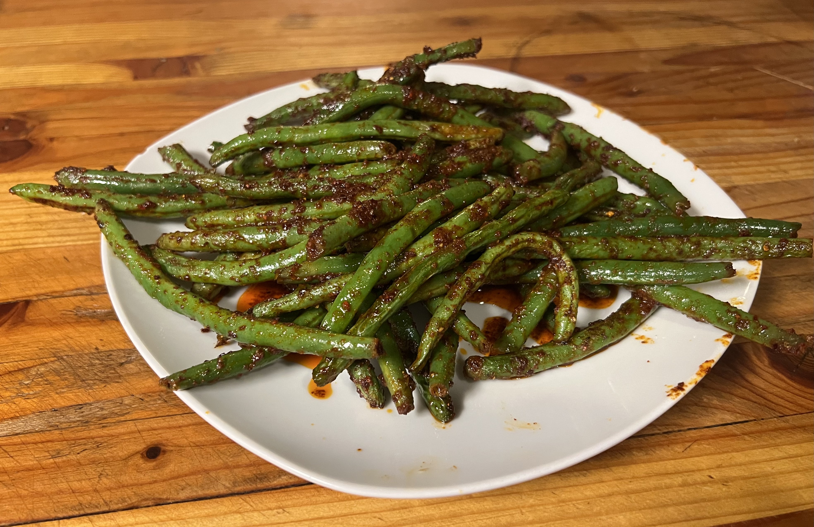

# Air Fried Green Beans

## Ingredients
 
* Green Beans
* [Spicy Olive Oil Marinade](../Marinades/Spicy_Olive_Oil.md)

## Instructs

1. Cut the stems off the green beans. Leave whole/long.
2. Toss in Spicy Olive Oil Marinade in a bow.
3. Air fry in toaster for 7 minutes on pan thing