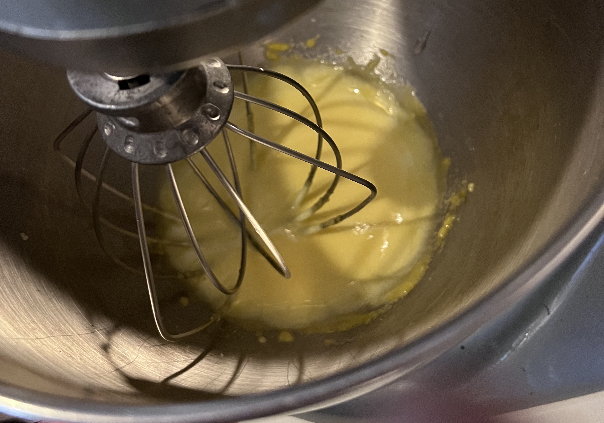

# Ice cream

## Ingredients

* (2) Egg Yolks
* (1/3 cup) Sugar
* (2 cups) Heavy Whip Cream
* (2 cups) Whole Milk

## Instructs

1. If using glass containers to store ice cream in, put empty containers in freezer.
2. [Separate egg yolks](/Reference/Egg_Yolks/readme.md).
3. Mix egg yolks and sugar in mixer until smooth: 
    
4. Add cream and milk, mix on high for a few minutes, until light and air, but not stiff (if it turns into whipped cream, you've gone too far).
5. Add mixture to ice-cream machine. Start machine.
6. [Optional] Add any mix-ins for variations.
7. Mix for 15-20 minutes.
8. Place in containers and freeze until ready to eat.

