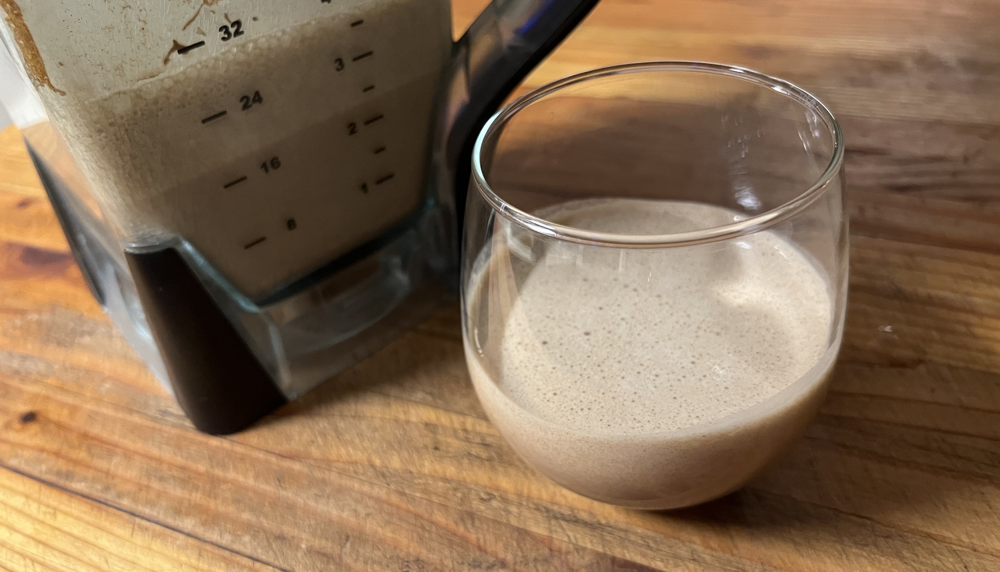

# Eggnog

## Ingredients

* (12) Eggs
* (1/3 Cup) Sugar
* (1 Pint) Cream
* (1 Pint) Whole Milk
* (2 Tsp) Cinnamon
* (1 Tsp) Nutmeg
* (Dash) Fresh Ground Cardamom

## Instructs (Easy Way)

1. Put all ingredients in a blender and blend until smooth. 

## Alcoholic Variations

Pairs well with Rum, Brandy, or Whiskey. Add alcohol before blending.

## Variation - Old-Fashioned Way

This variation uses the egg whites as a frothy topping.

1. Separate egg yolks and whites.
2. Beat the whites until they stiffen, then work in about a third of the sugar.
3. Add the rest of the ingredients into a blender, blend until smooth.
4. Put egg white mixture on top.
5. Sprinkle with nutmeg.
