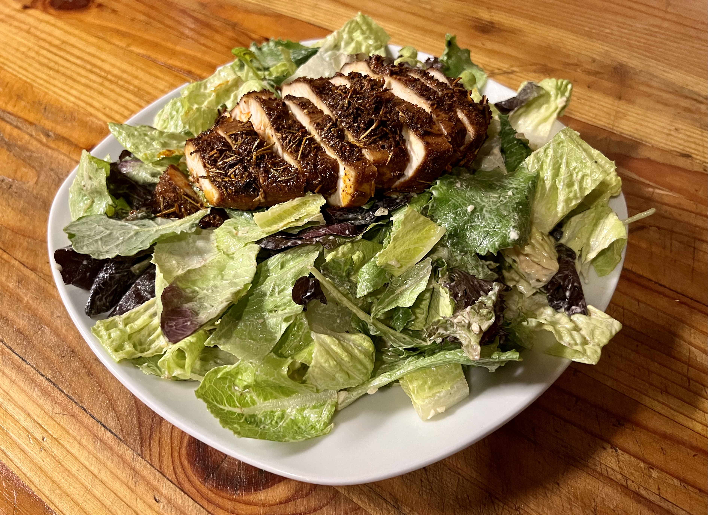

# Garlic Chipotle Aioli Chicken Salad

## Ingredients

* Romaine (or mixed greens)
* [Garlic Chipotle Sauce/Dressing](/Sauces/Garlic_Chipotle_Aioli/readme.md)
# [Spicy Roasted Chicken Breast](/Mains/Spicy_Chili_Roasted_Chicked_Breast/readme.md)
* [Garlic Croutons (Optional)](../../Appetizers_and_Sides/Garlic_Croutons/readme.md)

## Instructs

1. Chop romaine.
2. Toss with lots of Garlic Chipotle Dressing in a big mixing bowl.
3. Plate.
4. Chop chicken breast, and put on top.

## Variations

Also good with butter sautéd garlic shrimp.

## Pairs With

* Garlic Toast
* Bruschetta

