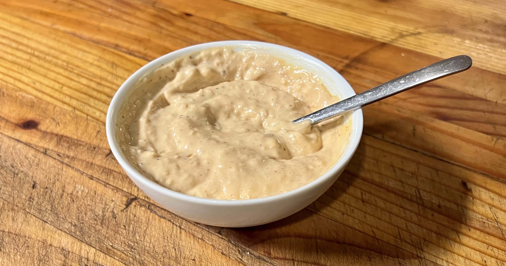

# Garlic Chipotle Aioli

## Ingredients

* (1/3 Cup) Vegenaise (or mayo)
* (3 large cloves) Garlic, finely minced
* (2 Tsp) [Tia Lupita Chipotle](https://tialupitafoods.com/products/chipotle-hot-sauce)

## Instructs

1. Put half the vegenaise and all the garlic in a microwave safe bowl and stir.
2. Microwave for 30 seconds, stir, and microwave for another 30 seconds.
3. Add Chipotle, mix